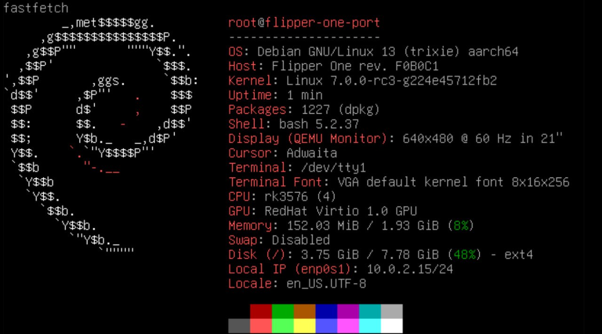

# Flipper Linux Firmware x86 Port


This is a small experiment where I try to run the Flipper One Linux kernel on a regular x86 PC using QEMU.

Recently the Flipper Devices team published the Linux kernel sources for their upcoming device. Flipper One is expected to be a portable mini computer based on an ARM processor.

Out of curiosity I wanted to see if it was possible to boot the system on a normal PC through virtualization.

This project is experimental and is not affiliated with Flipper Devices.

## What you need

* Linux (any distribution should work)
* QEMU
* Some free time to experiment

Tested on Kali Linux, but any Debian based distribution should work.

## Installing dependencies

Run:

```bash
sudo apt update
sudo apt install git build-essential bc bison flex libssl-dev libncurses-dev qemu-system-arm qemu-system-aarch64
```

## Using a prebuilt kernel

Download the kernel, rootfs and device tree from the Releases section.

Unpack rootfs:

```bash
zstd -d rootfs.img.zst
```

Then run:

```bash
sudo qemu-system-aarch64 \
-M virt \
-cpu cortex-a72 \
-m 2048 \
-smp 4 \
-kernel flipper-linux-kernel/arch/arm64/boot/Image \
-dtb virt_flipper.dtb \
-append "root=/dev/vda rw console=tty1" \
-drive file=rootfs.img,format=raw,if=virtio \
-device virtio-gpu-pci \
-device qemu-xhci \
-device usb-kbd \
-device usb-tablet \
-device intel-hda \
-device hda-duplex \
-usb \
(add this line for gpio) -device usb-host,hostbus=2,hostaddr=3 \
-display gtk
```

This is a minimal configuration that allows the system to boot.

## Hardware Bridge (GPIO/I2C)

For GPIO and I2C support via ESP32, see [Hardware Bridge documentation](docs/gpio_setup.md).

## Building the kernel yourself

Clone the kernel repository:

```bash
git clone --depth=1 https://github.com/flipperdevices/flipper-linux-kernel
cd flipper-linux-kernel
```

### Configure the kernel

Run:

```bash
make ARCH=arm64 menuconfig
```

Make sure these options are enabled:

* VirtIO
* VirtIO GPU
* Framebuffer console
* (for gpio please turn on ch341 support)


## Building the device tree
```bash
dtc -I dts -O dtb -o virt_flipper.dtb virt.dts
```
The custom device tree makes the system identify as Flipper One rev. F0B0C1 with RK3576 CPU while using virtual hardware.

## Build kernel

```bash
make ARCH=arm64 -j$(nproc)
```

## Preparing rootfs

Download the rootfs image from the official source.

Then run:

```bash
dd if=debian-4096-generic-build-854.img of=rootfs.img bs=1 skip=16777216
```

## Running the system

```bash
qemu-system-aarch64 \
-M virt \
-cpu cortex-a72 \
-m 2048 \
-smp 4 \
-kernel flipper-linux-kernel/arch/arm64/boot/Image \
-dtb virt_flipper.dtb \
-append "root=/dev/vda rw console=tty1" \
-drive file=rootfs.img,format=raw,if=virtio \
-device virtio-gpu-pci \
-device qemu-xhci \
-device usb-kbd \
-device usb-tablet \
-display gtk
```

## FOR RUN KDE PLASMA

```bash
Xorg :0 -retro -verbose 3 & sleep 3; DISPLAY=:0 dbus-run-session startplasma-x11
```

fastfetch

## What works

* Kernel boots
* System identifies as Flipper One rev. F0B0C1
* CPU reported as RK3576
* Display via virtio-gpu
* Network (Ethernet)
* KDE Plasma
* Battery node registered
* Power regulators registered (vcc8v4_sys, vcc3v3_control, vcc5v0_sys_s5)
* Sound card node present

## What doesn't work (yet)

* Real hardware (GPIO, SPI, I2C)
* I2C devices (PMIC rk806, GPIO expander, RTC, audio codec)
* MCU interconnect
* UFS storage
* USB hub

## Disclaimer

This project is not affiliated with Flipper Devices and exists only for experimentation.

