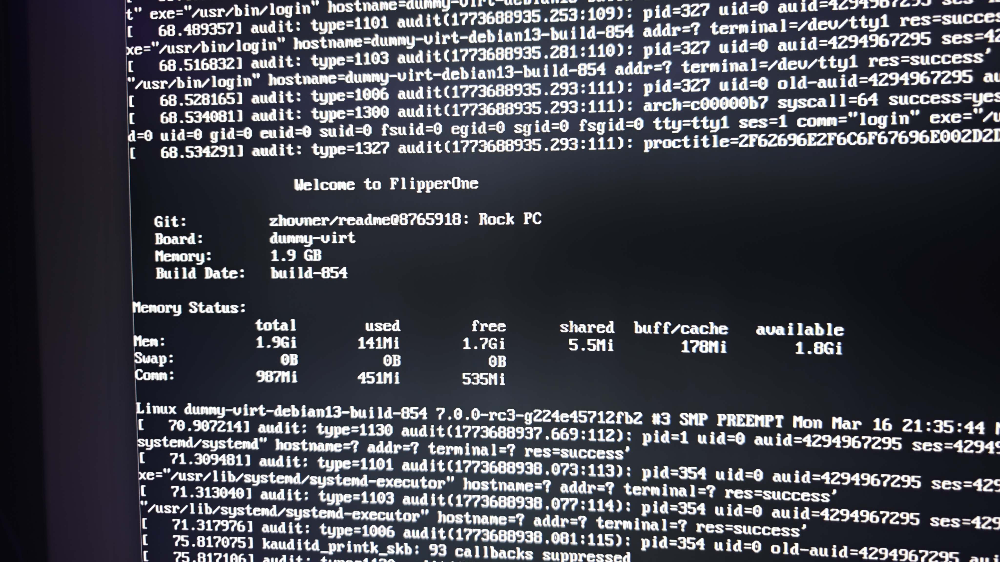
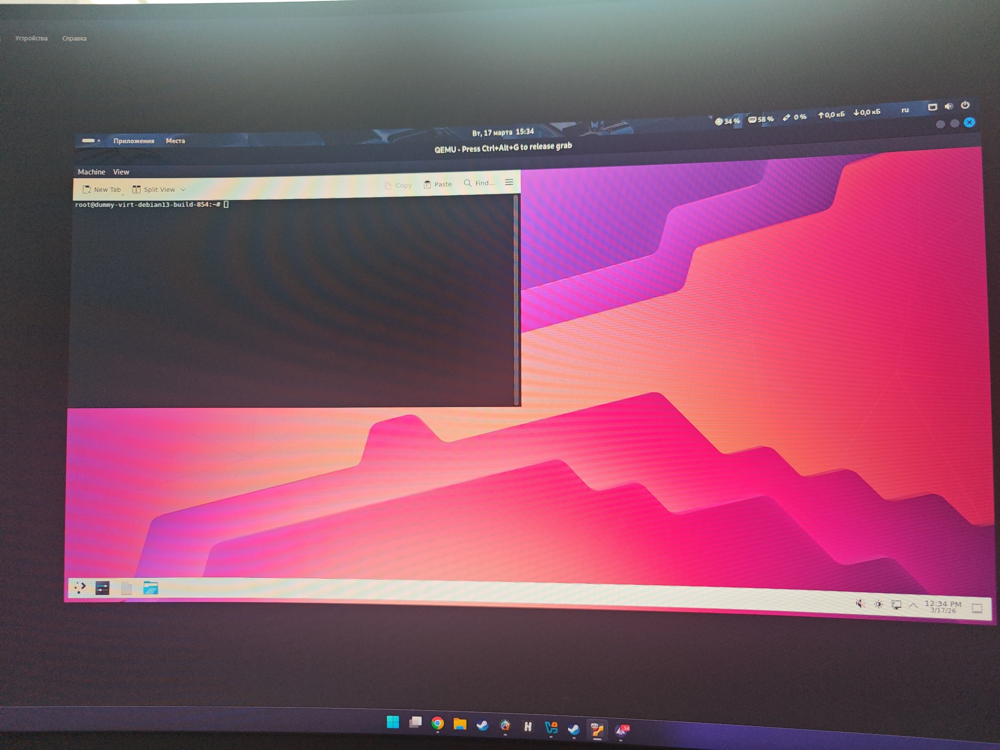

# Flipper Linux Firmware x86 Port

!!!! It's not the full system, just the rootfs and kernel running in QEMU.

Maybe it would be possible to emulate or fake some devices to see how the system initializes the hardware.

This is a small experiment where I try to run the Flipper One Linux kernel on a regular x86 PC using QEMU.

Recently the Flipper Devices team published the Linux kernel sources for their upcoming device. Flipper One is expected to be a portable mini computer based on an ARM processor.

Out of curiosity I wanted to see if it was possible to boot the system on a normal PC through virtualization.

This project is experimental and is not affiliated with Flipper Devices.

## What you need

* Linux (any distribution should work)
* QEMU
* Some free time to experiment

Tested on Kali Linux, but any Debian based distribution should work.

## Installing dependencies

Run:

```bash
sudo apt update
sudo apt install git build-essential bc bison flex libssl-dev libncurses-dev qemu-system-arm qemu-system-aarch64
```

## Using a prebuilt kernel

If you do not want to build the kernel yourself you can download the kernel and rootfs from the Releases section.

Unpack rootfs:
```bash
zstd -d rootfs.img.zst
```

Then run:

```bash
qemu-system-aarch64 \
-M virt \
-cpu cortex-a72 \
-m 2048 \
-kernel flipper-linux-kernel/arch/arm64/boot/Image \
-append "root=/dev/vda rw console=tty1" \
-drive file=rootfs.img,format=raw,if=virtio \
-device virtio-gpu-pci \
-device virtio-keyboard-pci \
-device qemu-xhci \
-device usb-kbd \
-display gtk
```

This is a minimal configuration that allows the system to boot.

## FOR RUN KDE PLASMA

```bash
Xorg :0 -retro -verbose 3 & sleep 3; DISPLAY=:0 dbus-run-session startplasma-x11
```

## Building the kernel yourself

Clone the kernel repository:

```bash
git clone --depth=1 https://github.com/flipperdevices/flipper-linux-kernel
cd flipper-linux-kernel
```

### Configure the kernel

Run:

```bash
make ARCH=arm64 menuconfig
```

Make sure these options are enabled:

* VirtIO
* VirtIO GPU
* Framebuffer console

### Build

```bash
make ARCH=arm64 -j$(nproc)
```

## Preparing rootfs

Download the rootfs image from the official source.

Then run:

```bash
dd if=debian-4096-generic-build-854.img of=rootfs.img bs=1 skip=16777216
```

## Running the system

```bash
qemu-system-aarch64 \
-M virt \
-cpu cortex-a72 \
-m 2048 \
-kernel flipper-linux-kernel/arch/arm64/boot/Image \
-append "root=/dev/vda rw console=tty1" \
-drive file=rootfs.img,format=raw,if=virtio \
-device virtio-gpu-pci \
-device virtio-keyboard-pci \
-device virtio-mouse-pci \
-display gtk
```

## FOR RUN KDE PLASMA

```bash
Xorg :0 -retro -verbose 3 & sleep 3; DISPLAY=:0 dbus-run-session startplasma-x11
```



## Current state

OS can run KDE Plasma.

## Disclaimer

This project is not affiliated with Flipper Devices and exists only for experimentation.
